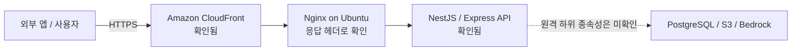
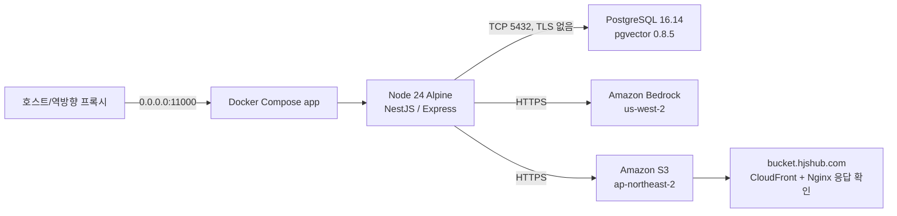

# HJ AI Server 운영 인프라 현행 구성(As-Is)

작성일: 2026-08-05
검증 대상: 현재 저장소, 로컬 Docker Compose 런타임, 공개 도메인, 서비스용 AWS 자격 증명으로 조회 가능한 리소스
주의: 계정 ID, access key, secret, DB 사용자·암호와 전체 DB 주소는 기록하지 않습니다.

## 1. 문서 목적과 증거 수준

이 문서는 현재 확인 가능한 운영 인프라를 기록하고, 저장소의 목표 설정과 실제 실행 상태의 차이를 식별합니다.

| 표기 | 의미 |
|---|---|
| 확인됨 | 명령 또는 HTTP 응답으로 실제 상태 확인 |
| 설정됨 | 저장소 또는 `.env`에 설정됐으나 원격 운영 적용 여부는 미확인 |
| 추정 | 응답 헤더 등 간접 증거로 판단 |
| 미확인 | 현재 IAM 권한 또는 저장소 정보만으로 검증 불가 |

공개 서비스와 현재 개발 PC의 Docker Compose가 동일한 origin인지 증명할 권한은 없습니다. 따라서 두 경로를 분리해 기술합니다.

## 2. 전체 구성 요약

### 2.1 공개 서비스에서 확인된 경로



| 계층 | 현재 상태 | 근거 |
|---|---|---|
| 공개 도메인 | `https://ai.hjshub.com` | DNS와 HTTPS 200 확인 |
| Edge/CDN | Amazon CloudFront | `Via`, `X-Cache`, `X-Amz-Cf-*` 응답 헤더 |
| Origin proxy | Nginx 1.28.3 on Ubuntu | 공개 API 응답의 `Server` 헤더 |
| API runtime | Express 기반 NestJS | `X-Powered-By: Express`, OpenAPI 응답 |
| 공개 API prefix | 도메인 루트 | `/` 200, `/ai` 404 |
| OpenAPI | `/api-docs-json`, 23 paths | 공개 HTTP 조회 |
| live/readiness | 없음 | `/health/live`, `/health/ready` 모두 404 |

CloudFront distribution의 origin, cache behavior, 인증서 상세는 서비스 IAM 사용자에게 `cloudfront:ListDistributions` 권한이 없어 확인하지 못했습니다.

### 2.2 저장소와 로컬 Compose에서 확인된 경로



이 경로는 현재 PC의 Docker Desktop/Compose와 `.env`를 기준으로 확인한 구성이며, 공개 CloudFront origin과 동일하다고 단정하지 않습니다.

## 3. 애플리케이션 컨테이너

### 3.1 이미지

| 항목 | 현재 구성 |
|---|---|
| Base image | `node:24-alpine` |
| Build | deps → build → production 3단계 multi-stage |
| Package 설치 | `npm ci`, production에서 `npm prune --omit=dev` |
| Prisma | build 시 client 생성 |
| Runtime user | 비 root 사용자 `nestjs` |
| Runtime port | 컨테이너 `11000` |
| Architecture | amd64 |
| 현재 image tag | `hj-ai-server:latest` |
| 현재 image 생성 시점 | 2026-08-05 UTC |
| Rollback tag | `hj-ai-server:rollback-20260805` (2026-06-21 image) |

현재 로컬 실행 이미지는 2026-08-05 작업 소스로 재생성했습니다. 이전 이미지는 rollback tag로 보관했지만, 배포 승인용 immutable commit SHA tag는 아직 사용하지 않습니다.

### 3.2 Compose 실행 상태

| 항목 | 실제 실행 상태 |
|---|---|
| Project/service | `hj_ai_server` / `app` |
| Container | `hj_ai_server-app-1` |
| 상태 | healthy, failing streak 0 |
| 시작 시점 | 2026-08-05 UTC |
| Restart | `unless-stopped` |
| Port publish | `0.0.0.0:11000 → 11000/tcp` |
| Network | Compose bridge `hj_ai_server_default` |
| Volume/mount | 없음 |
| Root filesystem | writable |
| CPU limit | 없음 |
| Memory limit | 없음 |
| PID limit | 없음 |
| Privileged | false |
| Linux capability drop | 별도 설정 없음 |
| Log driver | Docker `json-file`, rotation 설정 없음 |

현재 컨테이너는 `/health/live`와 `/health/ready`를 분리합니다. readiness는 DB를 실제 질의하고 S3·Bedrock 필수 설정을 확인하며, Compose health check는 외부 dependency 장애와 분리된 liveness를 사용합니다.

### 3.3 저장소 Compose 목표 설정

현재 `docker-compose.yml`은 다음을 정의합니다.

- production stage image build
- `.env` 전체 주입
- `PORT=11000` 강제
- 시작 시 `npx prisma migrate deploy`
- 이후 `npm run start:prod`
- host 11000 공개
- `/health/live` health check, 30초 간격, timeout 5초, 5회 재시도

## 4. 구성 드리프트 해소 결과

2026-08-05 로컬 Compose 재생성으로 다음 항목을 저장소 목표와 일치시켰습니다.

| 구분 | 실행 중 컨테이너 | 현재 저장소 목표 | 결과 |
|---|---|---|---|
| API prefix | 루트, `/ai` 404 | `API_GLOBAL_PREFIX=""`, 루트 | 일치 |
| Health path | `/health/live`, `/health/ready` | 동일 | 일치 |
| Startup command | migration deploy 후 start | 동일 | 일치 |
| 필수 환경변수 | startup validation 통과 | 누락 시 시작 실패 | 일치 |
| AppInfo 인증 | `x-admin-key` 필수 | 외부 appkey와 분리 | 일치 |
| 지식 운영 인증 | 별도 `x-admin-key` | knowledge-operator 역할 | 일치 |
| CORS | 공개 서비스 미확인 | exact-origin allowlist, 미설정 시 비활성 | 배포 확인 필요 |
| Swagger | 공개 OpenAPI 노출 확인 | 운영 기본 비활성, 명시적 활성화만 허용 | 배포 확인 필요 |
| 개발·legacy API | 공개 서비스에 다수 노출 | 세 호환 플래그 기본 false, 관리자 대체 경로 | 배포 확인 필요 |
| DB migration | 10개 적용, pending 0 | 최신 schema | 일치 |
| Image | 2026-08-05 재생성 | 현재 작업 소스 | 일치 |

AppInfo 관리자 인증과 HTTP 노출 정책은 현재 소스와 로컬 Compose에는 적용됐지만 공개 서비스 배포 여부는 미확인입니다. 로컬에서는 `SWAGGER_ENABLED=false`, exact CORS allowlist와 비허용 Origin 차단을 확인했습니다. 남은 차이는 공개 서비스에 live/readiness·최신 인증·CORS/Swagger 계약이 아직 확인되지 않았고, 로컬 image에 immutable commit SHA tag가 없다는 점입니다.

## 5. 공개 API 배포 상태

공개 OpenAPI에서 확인된 path는 23개입니다.

```text
/
/app-info
/app-info/{id}
/app-info/{id}/appkey
/bedrock/config
/bedrock/converse
/bedrock/models
/bedrock/text-response
/knowledge/answers
/knowledge/demo/store-seed
/knowledge/files
/knowledge/files/{id}
/knowledge/files/{id}/index
/knowledge/files/{id}/reindex
/knowledge/rag-response
/knowledge/search
/knowledge/texts
/storage/download
/storage/files
/storage/files/detail
/storage/upload
/test-tables
/test-tables/{id}
```

현재 소스에 존재하는 general answer, policy update, delete 등의 최신 계약과 공개 OpenAPI가 일치하지 않습니다. 또한 AppInfo, demo seed, test table, Bedrock config/models와 OpenAPI JSON이 공개 도메인에서 노출됩니다.

README의 `/ai` 기반 예시, 로컬 Compose의 `/ai` 실행 이미지, 공개 도메인의 root path가 서로 다릅니다.

## 6. PostgreSQL 및 pgvector

| 항목 | 현재 상태 |
|---|---|
| Engine | PostgreSQL 16.14, Debian build |
| Database | `hj-ai` |
| Port | 5432 |
| Address 형태 | 공인 IPv4 직접 지정, 전체 값은 `.env`에만 보관 |
| 현재 PC에서 연결 | 가능 |
| Transport TLS | 사용하지 않음 |
| Timezone | UTC |
| Vector extension | pgvector 0.8.5 |
| 확인 시 DB 크기 | 약 8.3 MiB |
| Prisma migrations | 10개 발견, 10개 적용, pending 0 |

2026-08-05 적용한 migration:

```text
20260718060000_add_rag_contract_baseline
```

확인되지 않은 항목:

- DB가 RDS인지 자체 호스팅 PostgreSQL인지
- firewall/security group 허용 범위
- 자동 backup, snapshot, PITR
- storage encryption at rest
- HA/replica/failover 구성
- connection pool과 최대 연결 수 운영 기준

현재 설정은 공인 주소의 PostgreSQL에 TLS 없이 연결합니다. 운영 전 private network 또는 제한된 접근 경로와 TLS 적용이 필요합니다.

## 7. Amazon Bedrock

| 항목 | 현재 설정/상태 |
|---|---|
| Runtime region | `us-west-2` |
| Generation model/profile | `us.anthropic.claude-sonnet-4-6` |
| Generation profile | ACTIVE 확인 |
| Embedding model | `amazon.titan-embed-text-v2:0` |
| Embedding provider | Amazon, 모델 조회 확인 |
| SDK | AWS SDK for JavaScript v3 |
| Generation API | Bedrock Runtime Converse API |
| Embedding API | Bedrock Runtime InvokeModel |

Bedrock와 S3가 서로 다른 region을 사용합니다. 애플리케이션이 문서를 먼저 다운로드한 뒤 Bedrock를 호출하므로 region 간 데이터 전송과 latency를 성능 측정에 포함해야 합니다.

Bedrock 운영 확인 항목:

- 모든 generation 호출에 명시적 `maxTokens`
- `InvocationThrottles`, `Invocations`, `InputTokenCount`, `OutputTokenCount`, `InvocationLatency`
- 실제 output token p95와 설정 maxTokens 비교
- RPM/TPM quota와 peak 사용량 비교
- 429, timeout, service unavailable에만 제한적 adaptive retry

## 8. Amazon S3 및 파일 배포

| 항목 | 현재 상태 |
|---|---|
| Bucket | `hj-erp-saas-s3` |
| Region | `ap-northeast-2` |
| Default encryption | SSE-S3 (`AES256`) |
| Versioning | Enabled |
| Object ownership | Bucket owner enforced |
| Bucket policy public 판정 | false |
| Block Public Access 4개 항목 | 모두 false |
| Server access logging | disabled |
| App configured CDN | `https://bucket.hjshub.com` |
| CDN 응답 | CloudFront 및 Nginx 응답 확인 |

Bucket policy는 public으로 판정되지 않았지만 account/bucket 단위 Block Public Access가 비활성입니다. future ACL/policy 변경 실수를 방지하도록 네 항목을 모두 활성화할지 검토해야 합니다. Object Ownership이 `BucketOwnerEnforced`이므로 ACL은 현재 비활성화되어 있지만 public policy 차단은 별도 보호가 필요합니다.

현재 CDN 도메인은 CloudFront 응답 뒤 Nginx가 확인되며, CloudFront origin과 bucket 접근 방식은 IAM 권한 부족으로 확인하지 못했습니다.

## 9. IAM 및 비밀 관리

### 현재 상태

- AWS 서비스 호출은 IAM user의 장기 access key를 `.env`에 저장해 사용합니다.
- 실행 컨테이너에도 access key와 secret key가 환경변수로 주입됩니다.
- 확인된 권한 범위에서 STS, 대상 S3, Bedrock 조회가 가능합니다.
- CloudFront distribution 목록 조회 권한은 없습니다.
- Secrets Manager, SSM Parameter Store, instance/task role 사용 증거는 없습니다.
- `APPKEY_JWT_SECRET`도 `.env` 파일로 관리합니다.
- AppInfo용 `ADMIN_API_KEY`는 appkey 서명 secret과 다른 32자 이상 값으로 분리했지만 현재는 `.env` 파일로 관리합니다.
- 지식 운영용 `KNOWLEDGE_OPERATOR_API_KEY`도 두 기존 secret과 다른 32자 이상 값이며 현재는 `.env` 파일로 관리합니다.
- appkey는 기본 `APPKEY_TTL_DAYS=90`의 JWT `exp`와 DB 만료 시각을 함께 사용합니다.
- appkey 회전 grace 상한은 `APPKEY_MAX_ROTATION_GRACE_SECONDS=86400`이며 기본 회전은 이전 키를 즉시 폐기합니다.
- 관리자·지식 운영자는 역할별 `*_PREVIOUS`와 `*_PREVIOUS_VALID_UNTIL`을 한 쌍으로 설정해 배포 중 신·구 키를 제한적으로 병행할 수 있습니다.

### 위험

- host 관리자와 Docker inspect 권한 보유자가 container environment를 읽을 수 있습니다.
- 장기 access key 회전·폐기 절차가 저장소에 없습니다.
- 배포 서버에 `.env`를 복사하는 방식은 감사와 환경별 분리를 어렵게 합니다.

### 목표

- AWS workload role 사용
- 민감 설정은 Secrets Manager 또는 SSM Parameter Store로 이전
- S3 bucket과 Bedrock model/profile로 task/application 권한 제한
- CloudTrail을 통한 AWS API audit
- 비밀 회전 시 새 deployment가 필요함을 runbook에 명시

## 10. 네트워크 및 노출 면

| 구간 | 현재 상태 |
|---|---|
| 외부 → API | HTTPS, CloudFront 경유 |
| CloudFront → origin | 상세 미확인, 공개 응답에서 Nginx 확인 |
| Host → container | 모든 host interface의 TCP 11000 |
| App → PostgreSQL | 공인 IPv4 TCP 5432, TLS 없음 |
| App → Bedrock | AWS public API HTTPS |
| App → S3 | AWS public API HTTPS |
| S3 file URL | `bucket.hjshub.com` CDN URL 생성 |

저장소에 VPC, subnet, security group, WAF, ACM, Route 53, CloudFront distribution을 정의하는 IaC가 없습니다. Nginx 설정도 README 예시만 있고 실제 운영 configuration은 저장소에서 관리되지 않습니다.

## 11. 배포 및 migration

### 현재 확인된 방식

```powershell
docker compose up -d --build
```

현재 실행 컨테이너는 Compose 정의에 따라 `prisma migrate deploy`가 성공한 뒤 `npm run start:prod`를 실행합니다. 2026-08-05 `20260805090000_add_security_credential_lifecycle`을 포함한 10개 migration 적용, pending migration 0건과 서버 시작 성공을 확인했습니다. 해당 migration은 기존 appkey에 90일 만료 시각을 backfill하고 보안 감사 테이블을 생성합니다.

### 배포 전 확인

1. `git status`와 배포 commit 확정
2. `npm ci`, build, lint, unit/integration/contract 실행
3. dependency와 container image scan
4. `npx prisma migrate status`
5. appcode 중복 preflight
6. API prefix와 health path 확정
7. image를 commit SHA로 tag
8. 새 container의 env key 목록과 role 확인
9. migration deploy
10. readiness와 demo contract smoke 확인
11. 공개 OpenAPI와 source OpenAPI 비교

HTTP 노출 변수와 검증 절차는 [HTTP 노출 보안 정책](HTTP_EXPOSURE_SECURITY.md)을 따릅니다.
개발·legacy endpoint와 관리자 대체 경로는 [운영 API 노출 정책](API_EXPOSURE_POLICY.md)을 따릅니다.

### Rollback 주의

- 현재 별도 blue/green 또는 rolling service가 없어 container 교체 중 중단 가능성이 있습니다.
- DB migration rollback 자동화가 없습니다.
- `latest` tag만으로는 이전 image 식별과 복구가 어렵습니다.
- migration이 backward compatible한지 먼저 확인해야 합니다.

## 12. 관측성, 로그와 감사

### 현재

- Docker `json-file` log driver
- log size/rotation 제한 없음
- Nest 기본 logging
- correlation ID 응답
- Bedrock와 knowledge query를 PostgreSQL에 일부 기록
- appkey 발급·회전과 관리자 API 접근·인증 실패·권한 거부를 PostgreSQL `security_audit_events`에 기록
- CloudWatch application log, Container Insights, trace, alert 설정 증거 없음
- S3 server access logging 비활성

### 필요한 운영 기준

- JSON 구조화 로그: timestamp, level, requestId, appcode, route, status, latency
- 질문/응답 PII 마스킹과 retention
- DB/S3/Bedrock latency 분리
- 401/403/429/5xx rate와 alert
- container CPU/memory/restart/health metric
- Bedrock token과 throttle metric
- S3 access audit와 CloudTrail data event 범위 결정
- 보안 감사 이벤트 retention, 외부 보관, 위변조 방지와 조회 권한 정책

Guardrail PII masking을 사용하더라도 원본 요청이 model invocation log에 남을 수 있으므로 로그 목적지 암호화, 접근 제어와 retention을 별도로 적용해야 합니다.

## 13. Backup 및 재해복구 상태

| 대상 | 확인 상태 |
|---|---|
| S3 object | versioning enabled |
| S3 cross-region replication | 미확인 |
| S3 lifecycle/retention | 미확인 |
| PostgreSQL backup/PITR | 미확인 |
| Container image history | `latest` 중심, 복구 보장 없음 |
| Infrastructure as Code | 없음 |
| Configuration backup | `.env` 기반, 관리 방식 미확인 |

RPO/RTO, DB backup 복구 시험, S3 version 복원 시험과 image rollback 절차는 아직 문서화되지 않았습니다.

## 14. 현재 구성에 없는 것으로 확인된 항목

저장소와 현재 런타임에서 다음 구성은 확인되지 않았습니다.

- ECS/Fargate/ECS Express Mode
- ECR repository 연계 및 lifecycle policy
- ALB와 target group health check
- auto scaling과 multi-instance
- deployment circuit breaker/automatic rollback
- WAF rule
- IaC(CDK/CloudFormation/Terraform)
- CI/CD pipeline
- Secrets Manager/SSM 기반 secret injection
- 중앙 로그와 운영 dashboard

향후 ECS/Fargate로 이전할 경우 execution role과 task role을 분리하고, private subnet의 NAT 또는 `ecr.api`, `ecr.dkr`, S3, CloudWatch Logs endpoint 구성을 함께 설계해야 합니다.

## 15. 우선 개선 순서

### P0 — 재배포 전

1. 현재 image/source/OpenAPI drift 해소
2. pending migration preflight와 적용
3. API prefix와 health path 단일화
4. AppInfo 최신 관리자 인증 배포 확인과 내부 endpoint 공개 차단
5. 고정 appkey fallback 제거
6. S3/embedding/appkey 환경변수 누락 해결
7. PostgreSQL TLS 및 접근 범위 제한
8. 장기 IAM user key 제거 계획

### P1 — 운영 안정화

1. live/readiness 분리
2. CPU/memory/PID와 log rotation 제한
3. image immutable tag와 rollback 보관
4. DB backup/PITR 확인과 복원 시험
5. Block Public Access와 S3 access logging 정책
6. 구조화 로그, metric, trace, alert
7. 관리자 identity 인증과 감사 retention·중앙 보관

### P2 — 확장 가능한 목표 인프라

1. IaC 도입
2. ECR scan/lifecycle
3. ECS Fargate 또는 동등한 managed container runtime 검토
4. multi-AZ/rolling or blue-green 배포
5. private networking과 workload IAM role
6. WAF, rate limit, centralized observability

## 16. 운영 확인 명령

비밀값을 출력하지 않는 확인 명령만 기록합니다.

```powershell
# Container 상태
docker compose ps
docker ps --format 'table {{.Names}}\t{{.Image}}\t{{.Status}}\t{{.Ports}}'

# Container 로그
docker compose logs --tail 200 app

# 저장소 기준 Compose 유효성
docker compose config --quiet

# DB migration 상태
npx prisma migrate status

# 공개/로컬 health smoke
curl.exe -i https://ai.hjshub.com/
curl.exe -i http://127.0.0.1:11000/health/live
curl.exe -i http://127.0.0.1:11000/health/ready

# 공개 OpenAPI
curl.exe -o public-openapi.json https://ai.hjshub.com/api-docs-json
```

`.env`, `docker inspect`의 전체 Env, AWS credential 출력은 운영 확인 로그에 남기지 않습니다.

## 17. 관련 문서

- [데모 개발 및 AI Server 검증·개선 통합 로드맵](DEMO_AI_SERVER_INTEGRATED_ROADMAP.md)
- [AI Server 실서비스 고도화 계획](AI_SERVER_HARDENING_PLAN.md)
- [외부 앱 공통 API 명세 초안](COMMON_API_SPEC_DRAFT.md)
- [기능·품질·성능 검증 전략](TEST_AND_PERFORMANCE_STRATEGY.md)
- [Credential 수명주기와 감사 운영 가이드](CREDENTIAL_LIFECYCLE_AND_AUDIT.md)
